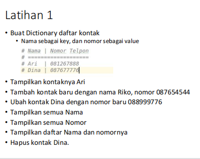
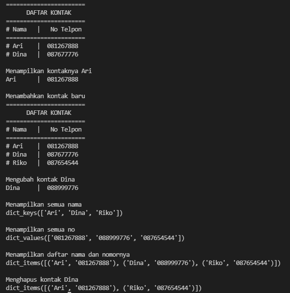
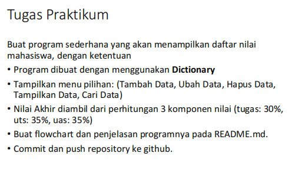
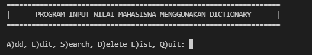
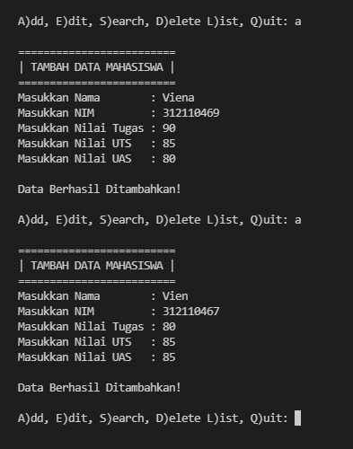
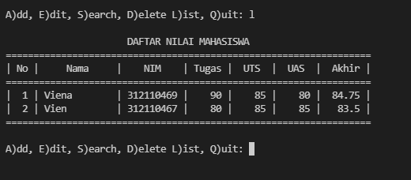
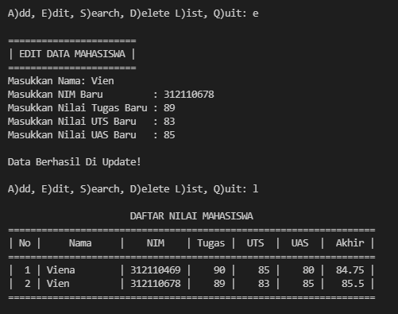
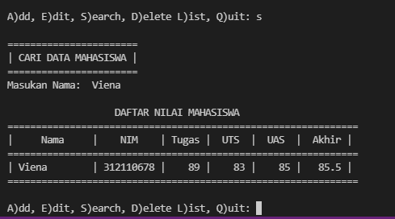
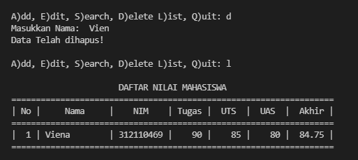
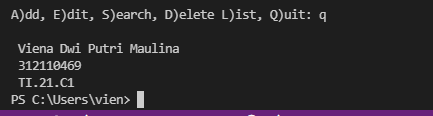

 # Tugas Bahasa Pemrograman
 <p> Nama   :   Viena Dwi Putri Maulina <p>
 <p> Nim    :   312110469
 <p> Kelas  :   TI.21.C1 <p>

 ## Latihan 1
<p> berikut soalnya <p>

 

<p> berikut programnya <p>

 ```python
 kontak={'Ari': '081267888', 'Dina': '087677776'}
print("=======================")
print("      DAFTAR KONTAK    ")
print("=======================")    
print("# Nama   |   No Telpon")
print("=======================")
print("# Ari    | ",   kontak['Ari'])
print("# Dina   | ", kontak['Dina'])
print("Menampilkan kontaknya Ari")
print("Ari      | ", kontak['Ari'])  # menampilkan kontak Ari
print("Menambahkan kontak baru")
kontak['Riko']='087654544' # menambah kontak baru
print("=======================")
print("      DAFTAR KONTAK    ")
print("=======================") 
print("# Nama   |   No Telpon")
print("=======================")
print("# Ari    | ",   kontak['Ari'])
print("# Dina   | ", kontak['Dina'])
print("# Riko   | ", kontak['Riko'])
print("Mengubah kontak Dina")
kontak['Dina']= '088999776' # Mengubah kontak Dina
print("Dina     | ", kontak['Dina']) 
print("Menampilkan semua nama")
print(kontak.keys())  # Menampilkan semua nama
print("Menampilkan semua no")
print(kontak.values())  # Menampilkan semua No
print("Menampilkan daftar nama dan nomornya")
print(kontak.items())  # Menampilkan daftar kontak
print("Menghapus kontak Dina")
del kontak['Dina'] # Menghapus kontak Dina
print(kontak.items())

 ```

 <p> kemudian run, hasilnya seperti ini <p>

 

 ## Praktikum 5

 <p> Berikut soalnya <p>

 

 <p>berikut programnya<p>

  ```python
  dataMahasiswa = {}
print("==================================================================")
print("|      PROGRAM INPUT NILAI MAHASISWA MENGGUNAKAN DICTIONARY      |")
print("==================================================================")

while True:
    c = input("\nA)dd, E)dit, S)earch, D)elete L)ist, Q)uit: ")

```
<p> kemudian muncul menu pilihan seperti ini <p>


## Menu ADD (menambahkan data)
<p> berikut program nya <p>

```python

    if (c.lower() == 'a'):
        print("\n=========================")
        print("| TAMBAH DATA MAHASISWA |")
        print("=========================")
        nama          = input("Masukkan Nama        : ")
        nim           = input("Masukkan NIM         : ")
        nilaiTugas    = int(input("Masukkan Nilai Tugas : "))
        nilaiUts      = int(input("Masukkan Nilai UTS   : "))
        nilaiUas      = int(input("Masukkan Nilai UAS   : "))
        nilaiAkhir    = (0.30 * nilaiTugas) + (0.35 * nilaiUts) + (0.35 * nilaiUas)
        dataMahasiswa[nama] = nim, nilaiTugas, nilaiUts, nilaiUas, nilaiAkhir
        print("\nData Berhasil Ditambahkan!")

```

<p> kemudian run, ketik huruf a. maka kita bisa menambahkan data. kemudian isi nama, nim, dan nilai nilainya.<p>
<p> berikut hasil run <p>


<p> untuk mengecek data bisa ketik l seperti ini <p>




## Menu EDIT (untuk mengubah data)
<p> berikut program nya <p>

```python
elif (c.lower() == 'e'):
        print("\n=======================")
        print("| EDIT DATA MAHASISWA |")
        print("=======================")
        nama = input("Masukkan Nama: ")
        if nama in dataMahasiswa.keys():
            nim           = input("Masukkan NIM Baru         : ")
            nilaiTugas    = int(input("Masukkan Nilai Tugas Baru : "))
            nilaiUts      = int(input("Masukkan Nilai UTS Baru   : "))
            nilaiUas      = int(input("Masukkan Nilai UAS Baru   : "))
            nilaiAkhir    = (0.30 * nilaiTugas) + (0.35 * nilaiUts) + (0.35 * nilaiUas)
            dataMahasiswa[nama] = nim, nilaiTugas, nilaiUts, nilaiUas, nilaiAkhir
            print("\nData Berhasil Di Update!")
        else:
            print("Data tidak ditemukan!")
```

<p> kemudian ubah data yang datanya sudah diinputkan seperti ini <p>



## Menu SEARCH (untuk mencari data)
<p> berikut program nya <p>

```python
  elif (c.lower() == 's'):
        print("\n=======================")
        print("| CARI DATA MAHASISWA |")
        print("=======================")
        nama = input("Masukan Nama:  ")
        if nama in dataMahasiswa.keys():
            print("\n                   DAFTAR NILAI MAHASISWA                   ")
            print("==============================================================")
            print("|     Nama     |    NIM    | Tugas |  UTS  |  UAS  |  Akhir |")
            print("==============================================================")
            print("| {0:12s} | {1:9s} | {2:5} | {3:5} | {4:5} | {5:6} |".format(nama, nim, nilaiTugas, nilaiUts, nilaiUas, nilaiAkhir))
            print("==============================================================")
        else:
            print("Datanya {0} Tidak Ada ".format(nama))
```
<p> kamudian ketik nama yang ingin dicari datanya seperti ini <p>



## Menu DELETE (Menghapus data)
<p> berikut program nya <p>

```python
  elif (c.lower() == 'd'):
        nama = input("Masukkan Nama:  ")
        if nama in dataMahasiswa.keys():
            del dataMahasiswa[nama]
            print("Data Telah dihapus!")
        else:
            print("Data Mahasiswa Tidak Ada".format(nama))
```
<p> kemudian ketik nama yang data nya akan diapus, seperti ini <p>



## Menu list (melihat data)
<p> berikut programnya <p>

```python
    elif (c.lower() == 'l'):
        if dataMahasiswa.items():
            print("\n                      DAFTAR NILAI MAHASISWA                    ")
            print("==================================================================")
            print("| No |     Nama     |    NIM    | Tugas |  UTS  |  UAS  |  Akhir |")
            print("==================================================================")
            i = 0
            for x in dataMahasiswa.items():
                i += 1
                print("| {6:2} | {0:12s} | {1:9s} | {2:5} | {3:5} | {4:5} | {5:6} |".format(x[0], x[1][0], x[1][1], x[1][2], x[1][3], x[1][4], i))
            print("==================================================================")
        else:
            print("\n                      DAFTAR NILAI MAHASISWA                    ")
            print("==================================================================")
            print("| No |     Nama     |    NIM    | Tugas |  UTS  |  UAS  |  Akhir |")
            print("==================================================================")
            print("|                          TIDAK ADA DATA!                       |")
            print("==================================================================")
```

<p> untuk melihat data ketik l , seperti berikut <p>


## Menu Quit (mengkhiri program)
<p> berikut programnya <p>

```python
  elif (c.lower() == 'q'):
        print("\n Viena Dwi Putri Maulina \n 312110469 \n TI.21.C1")
        break

    else:
        print("Pilih menu yang tersedia: ")
```


